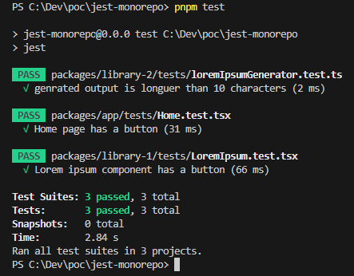

# jest-monorepo

## Usage

First install the dependencies with PNPM:

```bash
pnpm install
```

Then run the tests:

```bash
pnpm test
```

## Learning

- Jest [projects](https://jestjs.io/docs/configuration#projects-arraystring--projectconfig) works pretty well for a monorepo setup.

- The command can be executed at the root and the root Jest's config file is used.

- For every monorepo project, the root config is merged with the project's own Jest config. With this setup, configuration fields like `transform` can be kept code per project instead of configuring a generic global `transform` config in the root file.

- Every project tests are run in the same process and the results are outputed as a whole in a single report.



### Setup

- For Jest [projects](https://jestjs.io/docs/configuration#projects-arraystring--projectconfig) to work with a PNPM setup, Jest must also be installed at the root.

- If using a `.ts` configuration file for Jest, a root `ts.config.json` file should also be provided to configure TS.

- A `jest.config.ts` file cannot import ESM libraries nor used ESM assets syntax because the current implementation of `jest-config` hardcode the `module` prop to `CommonJS` (view https://github.com/jestjs/jest/blob/main/packages/jest-config/src/readConfigFileAndSetRootDir.ts#L118).